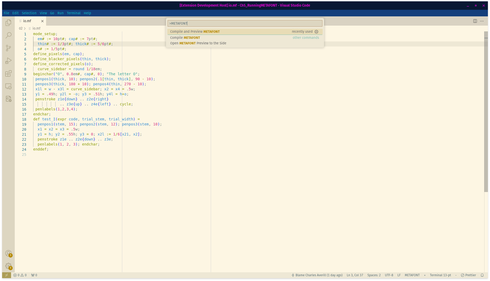
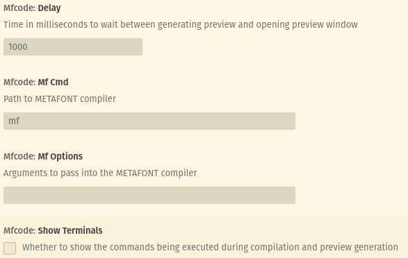

# mfcode 

`mfcode` provides language support for METAFONT

## Features
- Syntax highlighting
- Commands to compile and preview fonts

## Warning

This thing is pretty janky, be warned. These settings should help:

## Dependencies

Expects a Linux machine

- `mf`
- `gftodvi`
- `dvipdf`
- `pdftoppm`
- `imagemagick`
